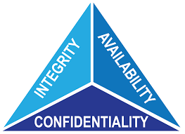

#
As I moved from an intern to a permanent role at my workplace, I was excited about the opportunity to contribute in a more significant way. Yet, as I settled into my new position, I couldn't help but notice a glaring gap in our organization's defenses: the lack of a structured cybersecurity architecture. Having studied cybersecurity intensively during my time at university, I understood the critical importance of addressing this issue to protect our digital assets.

Drawing on my academic background and practical knowledge, I recognized the urgency of implementing cybersecurity measures. Our company's reliance on digital systems meant that we were potentially vulnerable to a range of threats, from data breaches to malicious attacks. It was clear that establishing a robust cybersecurity framework was essential for safeguarding our daily operations.

Here is the CIA model:

Armed with the principles of the CIA model – Confidentiality, Integrity, and Availability – instilled in me during my studies, I undertook the responsibility of implementing a comprehensive cybersecurity architecture at the company.
Confidentiality emerged as a primary concern in preserving the privacy and security of our sensitive data. Drawing upon my knowledge of access controls, encryption techniques, and data classification methodologies from my University courses, I initiated the deployment of measures to restrict access to authorized personnel.By fortifying our defenses against unauthorized access and data breaches, we safeguarded the confidentiality of our most valuable assets.

Next, I turned my attention to ensuring the integrity of our data. Leveraging my understanding of cryptographic protocols, digital signatures, and data validation techniques, I instituted mechanisms to detect and prevent unauthorized alterations or tampering attempts. Through the implementation of integrity checks and audit trails, we could maintain the trustworthiness and reliability of our digital assets, mitigating the risk of malicious manipulation or corruption.

Finally, I addressed the critical need for maintaining the availability of our systems and services. Building upon my knowledge of redundancy strategies, failover mechanisms, and disaster recovery planning, I devised a robust framework to minimize downtime and ensure business continuity in the face of cyber threats or technical failures. By proactively identifying and mitigating potential points of failure, we bolstered our resilience and readiness to confront disruptions head-on.

Throughout the implementation process, I collaborated closely with cross-functional teams, leveraging their expertise and fostering a culture of cybersecurity awareness within the organization. From conducting training sessions to disseminating best practices, we empowered employees at all levels to play an active role in fortifying our digital defenses.

As our cybersecurity architecture took shape, I witnessed a transformation within the company – from a company vulnerable to cyber threats to one fortified by a robust security posture founded upon the principles of the CIA model. My transition from intern to permanent employee had not only brought new opportunities but also bestowed upon me the responsibility of shaping the future security landscape of the organization.

In the end, my journey at the company,reaffirmed the significance of education, initiative, and proactive engagement in addressing the evolving challenges of cybersecurity. By leveraging the knowledge gained from my cybersecurity program at university, I had contributed to creating a safer and more secure environment for our digital operations, laying the foundation for sustained growth and success in an increasingly interconnected world.
##

###

Connect with me at the following social platforms:
- [**X**](https://twitter.com/lexromoo)
- [**LinkedIn**](https://www.linkedin.com/in/alex-romo-0b720a2a2/)

